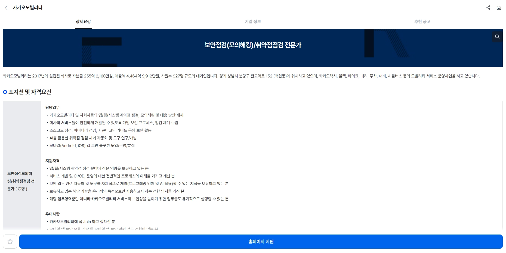
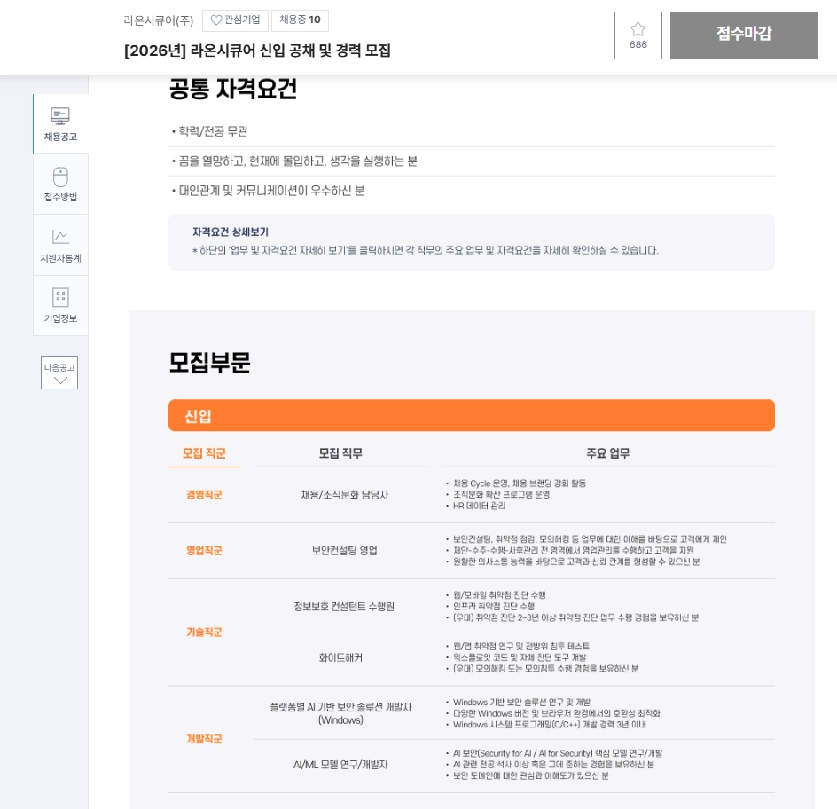
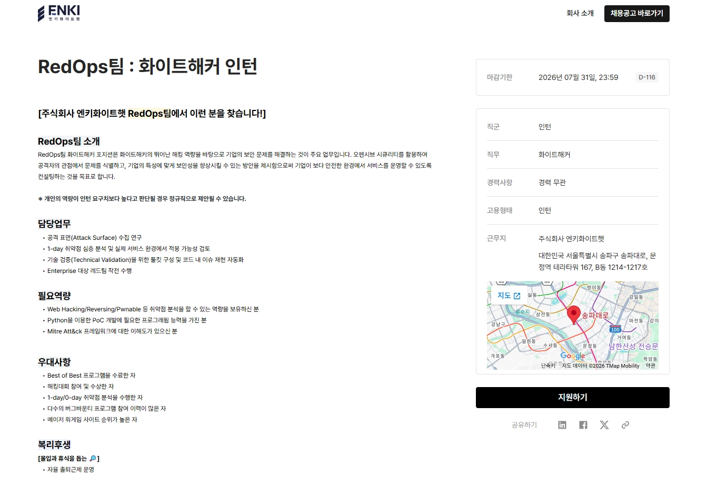
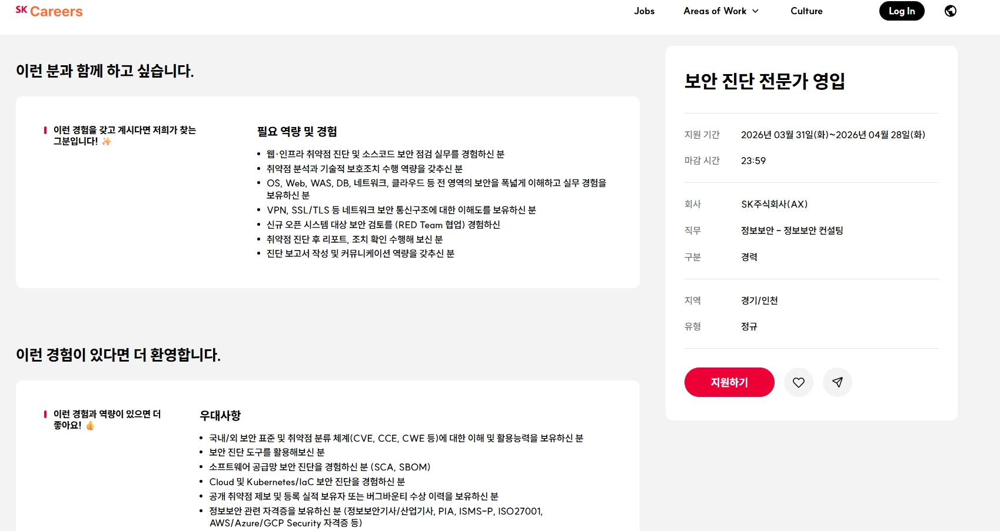
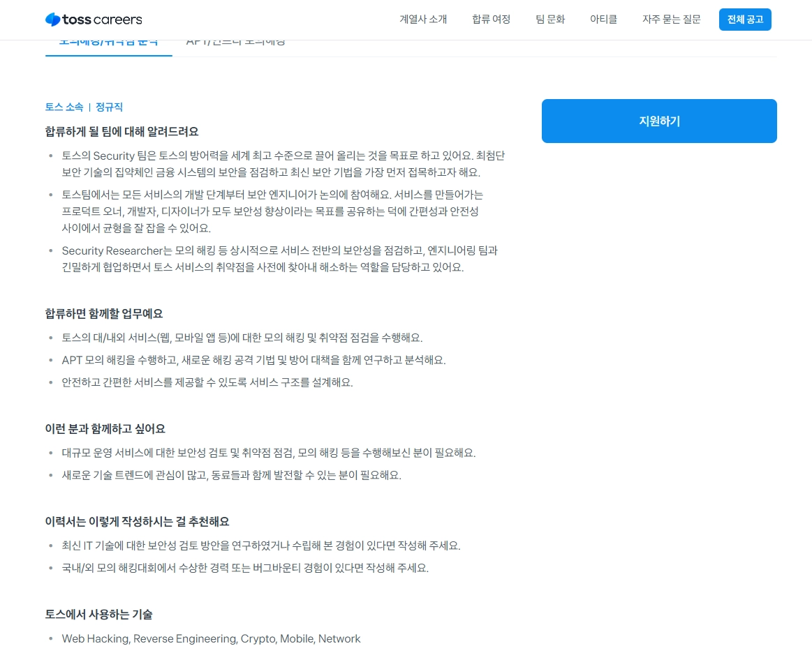

# 진로에 중요한 가치와 우선순위를 정하자면 

가장 중요한 가치 `**연봉**` , `**직무적합성**` 

우선순위가 낮은 가치 `**명예**` , `**조직문화**`

이렇게 고른 이유는 좋아하는 일 하면서 많이 받으면 좋으니까.. ㅎ 

## 내가 희망하는 회사

`**토스**` , `**SK쉴더스**` , `**엔키화이트햇**` <br>
~~꿈은 크게 가지라고 했어..~~



https://m.jobkorea.co.kr/Recruit/GI_Read/48837794?PageGbn=MST


https://www.saramin.co.kr/zf_user/jobs/relay/view?rec_idx=53173818&view_type=etc&nomo=1&srsltid=AfmBOoqnAP5BuK1cxEOauK6DY96S8bf7tifKpJl47dO9yVALPTHSh2no#seq=0


https://enki.career.greetinghr.com/ko/o/199221


https://www.skcareers.com/Recruit/Detail/R260737


[https://toss.im/career/job-detail?job_id=4076085003&srsltid=AfmBOoo6uOMZF8ePWq87Cj4xUT2n1CbZvFUXmWJuB9_cPNSg2_surQpl&sub_position_id=4076085003&company=토스](https://toss.im/career/job-detail?job_id=4076085003&srsltid=AfmBOoo6uOMZF8ePWq87Cj4xUT2n1CbZvFUXmWJuB9_cPNSg2_surQpl&sub_position_id=4076085003&company=%ED%86%A0%EC%8A%A4)


## 내가 해야할 것


### 우선 5개 기업에서 반복되서 나오는 역량 3개

1. 플랫폼별 취약점 진단 및 분석 능력: 웹(Web), 모바일(iOS/Android), 시스템 인프라 전반에 대한 깊은 이해와 실제 점검 경험.

2. 취약점 분석 및 익스플로잇 기술: 단순 툴 사용을 넘어 1-day/0-day 취약점을 분석하고 리버싱이나 코드를 통해 기술적으로 검증(PoC)할 수 있는 역량.

3. 최신 공격 시나리오 설계 (레드팀): MITRE ATT&CK 프레임워크 등을 활용하여 실제 공격자 관점에서 시나리오 기반의 모의 침투를 수행하는 능력.

```
공통적으로 실제 분석 경험과 버그바운티 수상 이력을 높게 평가 하더라 , 그래서 내가 해야하는 것은? 
실무형 Write up. 최신 취약점 분석 보고서를 주기적으로 업로드 하라네요
실제 인프라 환경을 구축해서 시나리오 기반 공격 실습하고 과정을 문서화 해놓기
```